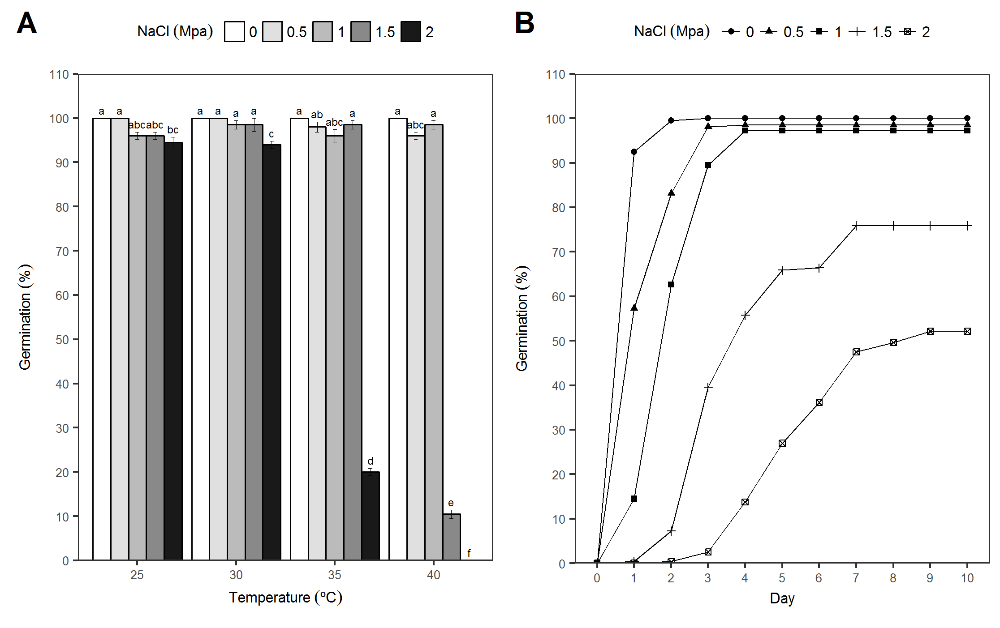

# Tables {-}

```{r functions, echo=FALSE}

funct <- dplyr::data_frame(
  
  "Function" = c("ger_summary", "ger_intime", "fplot", "GerminaQuant", "prosopis"),
  
  "Description"= c(
    
    "Calculate ten germination indices maintaining the factors levels for analysis of variance",
    "Calculates and displays cumulative germination data.",
    "Function that allows to graphic the results in bar or line plot.",
    "Runs the interactive application in offline mode for use on a personal computer.",
    "Dataset with germination experiment in *Prosopis juliflor* seeds under under different osmotic potentials and temperatures.")
)

knitr::kable(
  funct,
  booktabs = TRUE,
  caption = "Main functions in the GerminaR R package for seed germination variables and graphical analysis."
  )

```

# Figures {-}

(ref:gerplot) Germination  experiment with *Prosopis juliflor* under different osmotic potentials and temperatures. A) Bar graph with germination percentage in a factorial analisys. B)  Line graph from cumulative germination under different osmotic potentials.

```{r, germplot, fig.cap= '(ref:gerplot)'}

# load data

library(GerminaR)
library(cowplot)

fb <- prosopis %>% dplyr::mutate( nacl = as.factor(nacl), temp = as.factor(temp), rep = as.factor(rep))

## Puntual analysis

# germination analysis

gsm <- ger_summary(SeedN = "seeds", evalName = "D", data = fb)

# analisys of variance

av <- aov(formula = GRP ~ nacl*temp + rep, data = gsm)

# mean comparision test

mc <- ger_testcomp(aov = av, comp = c("temp", "nacl"), type = "snk")

# line or bar graphics

gbp <- fplot(data = mc, type = "bar", 
             x = "temp", y = "mean", z = "nacl", 
             lmt = c(0,110), brk = 10,
             ylab = "Germination ('%')", 
             xlab = "Temperature (ºC)", 
             lgl = "NaCl (Mpa)", lgd = "top", 
             sig = "sg", erb = T, color = F)

## Intime analysis

# data frame with percentual or relative germination in time

git <- ger_intime(Factor = "nacl", SeedN = "seeds", evalName = "D", method = "percentage", data = fb)

# graphic germination in time

ggt <- fplot(data = git, type = "line", 
             x = "evaluation", y = "mean", z = "nacl", 
             lmt = c(0,110), brk = 10,
             ylab = "Germination ('%')", 
             xlab = "Day", 
             lgl = "NaCl (Mpa)", 
             lgd = "top", color = FALSE)


## Plot figures

gerplot <- cowplot::ggdraw(xlim = c(0, 1), ylim = c(0, 0.5))+
  draw_plot(gbp, width = 0.5, height = 0.5, x = 0.0, y = 0.0) +
  draw_plot(ggt, width = 0.5, height = 0.5, x = 0.5, y = 0.0) +
  draw_plot_label(label = c("A", "B"), x = c(0.0, 0.5), y = c(0.5, 0.5))

cowplot::ggsave("img/gerplot.tiff", dpi= 300, width = 210*0.9 , height = 297*0.4, units = "mm")
cowplot::ggsave("img/gerplot.png", dpi= 300, width = 210*0.9 , height = 297*0.4, units = "mm")



```
