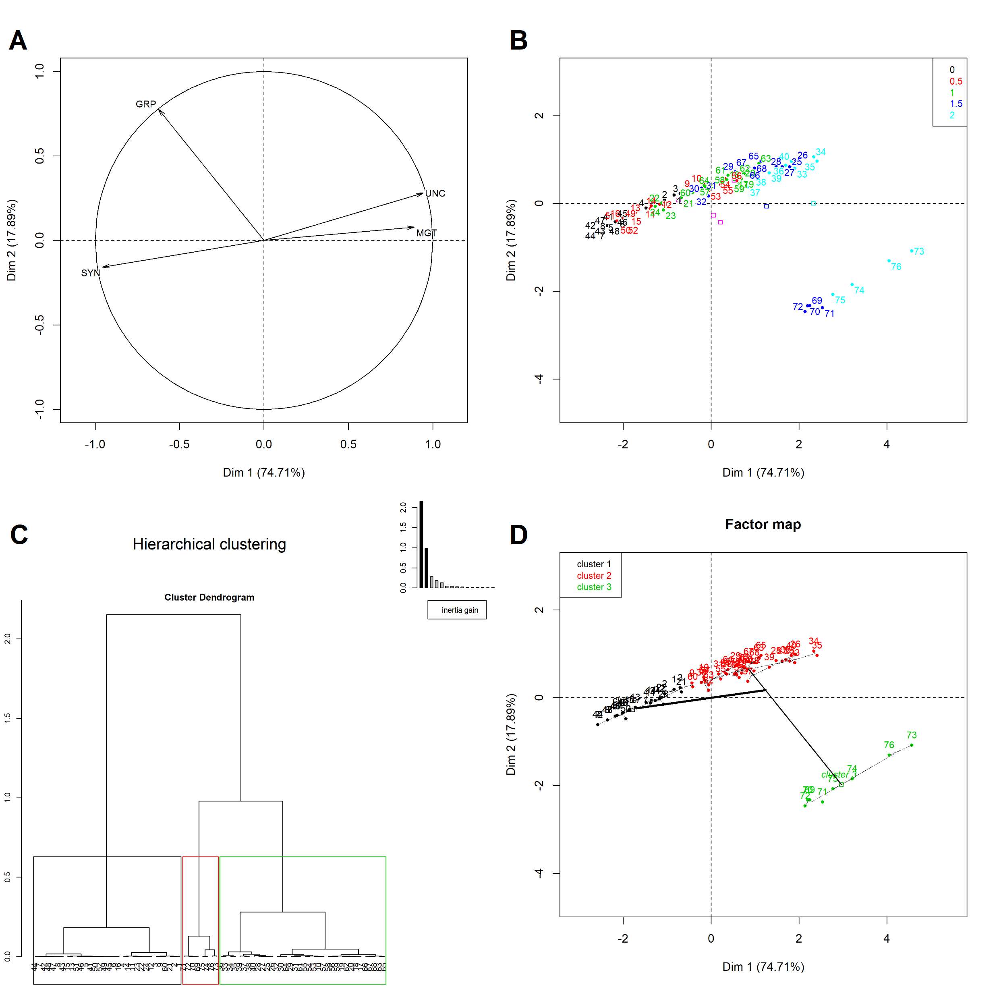

```{r setup, include=FALSE}

# browseURL("https://www.zotero.org/styles")
# browseURL("https://retorque.re/zotero-better-bibtex/")

knitr::opts_chunk$set(
  out.width="90%", fig.align = "center",
	echo = FALSE, message = FALSE, warning = FALSE)

options(digits = 4, OutDec= ".", knitr.kable.NA = '',
  knitr.table.format = "pandoc", 
  citr.use_betterbiblatex = FALSE)

library(rosr)
library(bookdown)
library(inserttable) # devtools::install_github("lbusett/insert_table")
library(knitr)
library(DT)
library(citr)
library(googlesheets)
library(tidyverse)
library(agricolae)
library(compareGroups)
library(FactoMineR)
library(GerminaR)
library(cowplot)
library(grid) 
library(png)
library(jpeg)

aut <- gs_ls()
gs <- gs_url("https://docs.google.com/spreadsheets/d/1QziIXGOwb8cl3GaARJq6Ez6aU7vND_UHKJnFcAKx0VI/edit#gid=137089581") 
# browseURL(gs$browser_url)
# browseURL("https://flavjack.github.io/rticles/")

fb <- gs %>% 
  gs_read(ws = "prosopis") %>% 
  select_all(funs(tolower)) %>%            
  select_all(funs(gsub("\\s+|\\.", "_", .))) %>% 
  mutate_if(is.character, funs(tolower)) %>% 
  mutate_if(is.character, funs(gsub("\\s+|\\.", "_", .))) %>% 
  mutate_at(vars(rep, nacl, temp), funs(as.character))

openxlsx::write.xlsx(x = fb, file = "img/data_set.xlsx")
utils::zip(zipfile = "docs/files.zip", files = "img/data_set.xlsx")

```

# {-}

1. Agronomist, Co-founder of Quipo.org, Lima, Perú.

`*` Corresponding author.: flavjack@gmail.com; Tel. +51 999997400

# Abstract {-}

Class aptent taciti sociosqu ad litora torquent per conubia nostra, per inceptos himenaeos. Curabitur sodales ligula in libero. Sed dignissim lacinia nunc. Curabitur tortor. Pellentesque nibh. Aenean quam. In scelerisque sem at dolor. Maecenas mattis. Sed convallis tristique sem. Proin ut ligula vel nunc egestas porttitor. Morbi lectus risus, iaculis vel, suscipit quis, luctus non, massa. Fusce ac turpis quis ligula lacinia aliquet. Mauris ipsum. Nulla metus metus, ullamcorper vel, tincidunt sed, euismod in, nibh. Quisque volutpat condimentum velit. Class aptent taciti sociosqu ad litora torquent per conubia nostra, per inceptos himenaeos. Nam nec ante. Sed lacinia, urna non tincidunt mattis, tortor neque adipiscing diam, a cursus ipsum ante quis turpis. _Nulla facilisi_ Ut fringilla. **Suspendisse potenti** Nunc feugiat mi a tellus consequat imperdiet. Vestibulum sapien. Proin quam. Etiam ultrices. Suspendisse in justo eu magna luctus suscipit. Sed lectus. Integer euismod lacus luctus magna. Quisque cursus, metus vitae pharetra auctor, sem massa mattis sem, at interdum magna augue eget diam. 

**Keywords:** Lorem, ipsum, dolor, sit amet, consectetur.

# Introduction

Lorem ipsum @lozano-isla2018Effects dolor sit amet, consectetur adipiscing elit. Integer nec odio. Praesent libero. Sed cursus ante dapibus diam. Sed nisi. Nulla quis sem at nibh elementum imperdiet. Duis sagittis ipsum. Praesent mauris Fusce nec tellus sed augue semper porta. Mauris massa. Vestibulum lacinia arcu eget nulla Class aptent taciti sociosqu ad litora torquent per conubia nostra, per inceptos himenaeos. Curabitur sodales ligula in libero. Sed dignissim lacinia nunc [@maluszynski2009Methodologies; @pompelliAllometricModelsNondestructive2012]. 

Curabitur tortor [@avenot2009Characterizationa; @zarate2017Respuesta] Pellentesque nibh. Aenean quam. In scelerisque sem at dolor. Maecenas mattis. Sed convallis tristique sem. Proin ut ligula vel nunc egestas porttitor. Morbi lectus risus, iaculis vel, suscipit quis, luctus non, massa. Fusce ac turpis quis ligula lacinia aliquet. Mauris ipsum. Nulla metus metus, ullamcorper vel, tincidunt sed, euismod in, nibh. Quisque volutpat condimentum velit. Nulla facilisi. Ut fringilla. Suspendisse potenti. Nunc feugiat mi a tellus consequat imperdiet. Vestibulum sapien. Proin quam. Etiam ultrice. Suspendisse in justo eu magna luctus suscipit. Sed lectus. Integer euismod lacus luctus magna. 

# Materials and Methods

The data was analyzed in the statistical software R [@R-base]. The germination analysis and graphics was carried out with the package GerminaR [@R-GerminaR]. Each variable was submitted at analysis of variance (ANOVA) and the mean comparison test used was Student-Newman Keuls (P<0.05)[@R-agricolae]. For the multivariate analysis, the principal components analysis (PCA) and cluster hierarchical classification analysis (HCPC) will be used [@R-FactoMineR]. 

The vertical bars represent the means (±SE). The mean differences between the groups are represented by different capital letters and into the group different lowercase letters (SNK, p = 0.05) [@gutierrez2018Contribution].

More information about multivarite analysis in http://factominer.free.fr/index.html. Explanation for intepretation and analysis:

**PCA:** https://www.youtube.com/watch?v=pks8m2ka7Pk&feature=youtu.be

**HCPC:** https://www.youtube.com/watch?v=4XrgWmN9erg

## Data set

The data set used for this analysis is available in the following link: [DATA SET](https://docs.google.com/spreadsheets/d/1QziIXGOwb8cl3GaARJq6Ez6aU7vND_UHKJnFcAKx0VI/edit#gid=137089581) 

## Nulla metus metus

Curabitur tortor. Pellentesque nibh. Aenean quam. In scelerisque sem at dolor. Maecenas mattis. Sed convallis tristique sem. Proin ut ligula vel nunc egestas porttitor. Morbi lectus risus, iaculis vel, suscipit quis, luctus non, massa. Fusce ac turpis quis ligula lacinia aliquet. Mauris ipsum. Nulla metus metus, ullamcorper vel, tincidunt sed, euismod in, nibh. Quisque volutpat condimentum velit. Class aptent taciti sociosqu ad litora torquent per conubia nostra, per inceptos himenaeos. Nam nec ante (Table \@ref(tab:functions)).

# Results

##  Sed convallis tristique sem

Lorem ipsum dolor sit amet, consectetur adipiscing elit. Integer nec odio. Praesent libero. Sed cursus ante dapibus diam. Sed nisi. Nulla quis sem at nibh elementum imperdiet. Duis sagittis ipsum. Praesent mauris. Fusce nec tellus sed augue semper porta. Mauris massa. Vestibulum lacinia arcu eget nulla. Class aptent taciti sociosqu ad litora torquent per conubia nostra, per inceptos himenaeos $g=\left(\frac{\sum_{i=1}^kn_1}{N}\right)100$. 

Curabitur sodales ligula in libero. Sed dignissim lacinia nunc. Curabitur tortor. Pellentesque nibh. Aenean quam. In scelerisque sem at dolor. Maecenas mattis. Sed convallis tristique sem. Proin ut ligula vel nunc egestas porttitor. Morbi lectus risus, iaculis vel, suscipit quis, luctus non, massa. Fusce ac turpis quis ligula lacinia aliquet. Mauris ipsum. 

```{r include_code, echo=TRUE, eval=FALSE}

# load data

library(GerminaR)

fb <- prosopis %>% dplyr::mutate( nacl = as.factor(nacl), temp = as.factor(temp), rep = as.factor(rep))

# germination analysis

gsm <- ger_summary(SeedN = "seeds", evalName = "D", data = fb)
str(gsm)

# analisys of variance

av <- aov(formula = GRP ~ nacl*temp + rep, data = gsm)
summary(av)

# mean comparision test

mc <- ger_testcomp(aov = av, comp = c("temp", "nacl"), type = "snk")
  
```

##  Class aptent taciti

Nulla metus metus, ullamcorper vel, tincidunt sed, euismod in, nibh. Quisque volutpat condimentum velit. Class aptent taciti sociosqu ad litora torquent per conubia nostra, per inceptos himenaeos. Nam nec ante. Sed lacinia, urna non tincidunt mattis, tortor neque adipiscing diam, a cursus ipsum ante quis turpis. Nulla facilisi. Ut fringilla. Suspendisse potenti. Nunc feugiat mi a tellus consequat imperdiet. Vestibulum sapien. Proin quam. Etiam ultrices. Figure: \@ref(fig:germplot). 

# Discussion

Curabitur tortor @leon2018Nitrogen and @dixit2015Adaptacion, Pellentesque nibh. Aenean quam. In scelerisque sem at dolor. Maecenas mattis. Sed convallis tristique sem. Proin ut ligula vel nunc egestas porttitor. Morbi lectus risus, iaculis vel, suscipit quis, luctus non, massa. Fusce ac turpis quis ligula lacinia aliquet. Mauris ipsum. Nulla metus metus, ullamcorper vel, tincidunt sed, euismod in, nibh. Quisque volutpat condimentum velit. Class aptent taciti sociosqu ad litora torquent per conubia nostra, per inceptos himenaeos. Nam nec ante (Table \@ref(tab:functions)).

Sed lacinia, urna non tincidunt mattis, tortor neque adipiscing diam, a cursus ipsum ante quis turpis. Nulla facilisi. Ut fringilla. Suspendisse potenti. Nunc feugiat mi a tellus consequat imperdiet. Vestibulum sapien. Proin quam. Etiam ultrices. Suspendisse in justo eu magna luctus suscipit. Sed lectus. Integer euismod lacus luctus magna. Quisque cursus, metus vitae pharetra auctor, sem massa mattis sem, at interdum magna augue eget diam. Vestibulum ante ipsum primis in faucibus orci luctus et ultrices posuere cubilia Curae; Morbi lacinia molestie dui. Praesent blandit dolor [@blum2005Drought]. 

# Conclusions

Class aptent taciti sociosqu ad litora torquent per conubia nostra, per inceptos himenaeos. Curabitur sodales ligula in libero. Sed dignissim lacinia nunc. Curabitur tortor. Pellentesque nibh. Aenean quam. In scelerisque sem at dolor. Maecenas mattis. Sed convallis tristique sem. Proin ut ligula vel nunc egestas porttitor. Morbi lectus risus, iaculis vel, suscipit quis, luctus non, massa. Fusce ac turpis quis ligula lacinia aliquet. Mauris ipsum. Nulla metus metus, ullamcorper vel, tincidunt sed, euismod in, nibh. Quisque volutpat condimentum velit. Class aptent taciti sociosqu ad litora torquent per conubia nostra, per inceptos himenaeos. Nam nec ante. Sed lacinia, urna non tincidunt mattis, tortor neque adipiscing diam, a cursus ipsum ante quis turpis. Nulla facilisi. Ut fringilla. Suspendisse potenti. Nunc feugiat mi a tellus consequat imperdiet. 

# Acknowledgments

Donec lacus nunc, viverra nec, blandit vel, egestas et, augue. Vestibulum tincidunt malesuada tellus. Ut ultrices ultrices enim. Curabitur sit amet mauris. Morbi in dui quis est pulvinar ullamcorper. Nulla facilisi. Integer lacinia sollicitudin massa. Cras metus. Sed aliquet risus a tortor. Integer id quam. Morbi mi. 


# Tables {-}

```{r functions}

tb <- dplyr::tibble(
  
  "Function" = c("ger_summary", "ger_intime", "fplot", "GerminaQuant", "prosopis"),
  
  "Description"= c(
    
    "Calculate ten germination indices maintaining the factors levels for analysis of variance",
    "Calculates and displays cumulative germination data.",
    "Function that allows to graphic the results in bar or line plot.",
    "Runs the interactive application in offline mode for use on a personal computer.",
    "Dataset with germination experiment in *Prosopis juliflor* seeds under under different osmotic potentials and temperatures.")
  
)

tb %>% 
  knitr::kable(
    booktabs = TRUE,
    format = "pandoc",
    caption = "Main functions in the GerminaR R package for seed germination variables and graphical analysis.")

```


```{r}

fb %>% 
  mutate_if(is.numeric, ~round(., 2)) %>% 
  datatable(extensions = c('Buttons', 'Scroller'),
            rownames = FALSE,
            options = list(dom = 'Bt',
                    buttons = list('copy', 'excel'),
                    autoWidth = TRUE, scroller = TRUE,
                    scrollY = "50vh", scrollX = TRUE),
            
            caption =  "Germination Dataset")

```

# Figures {-}

(ref:gerplot) Germination  experiment with *Prosopis juliflor* under different osmotic potentials and temperatures. A) Bar graph with germination percentage in a factorial analisys. B)  Line graph from cumulative germination under different osmotic potentials.

```{r germplot, fig.align='center', fig.cap= '(ref:gerplot)'}

## Puntual analysis

# germination analysis

gsm <- ger_summary(SeedN = "seeds", evalName = "d", data = fb)

# analisys of variance

av <- aov(formula = GRP ~ nacl*temp + rep, data = gsm)

# mean comparision test

mc <- ger_testcomp(aov = av, comp = c("temp", "nacl"), type = "snk")

# line or bar graphics

gbp <- fplot(data = mc, type = "bar", 
             x = "temp", y = "mean", z = "nacl", 
             lmt = c(0,110), brk = 10,
             ylab = "Germination ('%')", 
             xlab = "Temperature (ºC)", 
             lgl = "NaCl (Mpa)", lgd = "top", 
             sig = "sg", erb = T, color = F)

## Intime analysis

# data frame with percentual or relative germination in time

git <- ger_intime(Factor = "nacl", SeedN = "seeds", evalName = "d", method = "percentage", data = fb)

# graphic germination in time

ggt <- fplot(data = git, type = "line", 
             x = "evaluation", y = "mean", z = "nacl", 
             lmt = c(0,110), brk = 10,
             ylab = "Germination ('%')", 
             xlab = "Day", 
             lgl = "NaCl (Mpa)", 
             lgd = "top", color = FALSE)

## Plot figures

gerplot <- cowplot::ggdraw(xlim = c(0, 1), ylim = c(0, 0.5))+
  draw_plot(gbp, width = 0.5, height = 0.5, x = 0.0, y = 0.0) +
  draw_plot(ggt, width = 0.5, height = 0.5, x = 0.5, y = 0.0) +
  draw_plot_label(label = c("A", "B"), x = c(0.0, 0.5), y = c(0.5, 0.5))

cowplot::save_plot("img/fig_gerplot.png", 
                   plot = gerplot,
                   dpi= 300, 
                   base_height = 100, 
                   base_aspect_ratio = 2, 
                   units = "mm")

cowplot::save_plot("img/fig_gerplot.tiff", 
                   plot = gerplot,
                   dpi= 300, 
                   base_height = 100, 
                   base_aspect_ratio = 2, 
                   units = "mm")

knitr::include_graphics("img/fig_gerplot.png")

```


```{r, fig.align='center', fig.cap= "Plant of *Jatropha curcas*. A) Foliage, B) Leaf, C) Fruit."}

fg <- jpeg::readJPEG("img/fig_jc.jpg") %>% 
  grid::rasterGrob(interpolate = TRUE)

plot <- cowplot::ggdraw(xlim = c(0, 0.5), ylim = c(0, 0.5))+
  draw_plot(fg, width = 0.5, height = 0.5, x = 0.0, y = 0.0) +
  draw_plot_label(label = c("A", "B", "C"),
                  x = c(0.01, 0.26, 0.01), 
                  y = c(0.48, 0.48, 0.15))

cowplot::save_plot("img/fig_jcurcas.png", 
                   plot = plot,
                   dpi= 300, 
                   base_height = 100, 
                   base_aspect_ratio = 1.2, 
                   units = "mm")

cowplot::save_plot("img/fig_jcurcas.tiff", 
                   plot = plot,
                   dpi= 300, 
                   base_height = 100, 
                   base_aspect_ratio = 1.2, 
                   units = "mm")

include_graphics("img/fig_jcurcas.png")

```


```{r, fig.align= 'center', fig.cap= "Multivariate Analysis: Principal component Analysis and Hierarchical Clustering Analysis."}

# Principal componet Analysis

pca <- gsm %>% 
  drop_na() %>% 
  # select_if(., is.numeric) %>% 
  select(nacl, temp, GRP, MGT, UNC, SYN) %>% 
  
  PCA(X = ., 
      scale.unit = T,
      graph = F,
      quali.sup = c(1,2))


# summary.PCA(pca, nb.dec = 2, nbelements = Inf)
# dimdesc(pca)

# library(FactoInvestigate)
# Investigate(pca, document = "pdf_document")

ppi <- 300
png("img/fig_pca_var.png", width=7*ppi, height=7*ppi, res=ppi)

plot.PCA(pca,
         choix="var",
         title="",
         autoLab = "y", 
         cex = 0.8,
         shadowtext = T)

graphics.off()

ppi <- 300
png("img/fig_pca_ind.png", width=7*ppi, height=7*ppi, res=ppi)

plot.PCA(pca,
         choix="ind",
         habillage = 1,
         title="",
         autoLab = "y", 
         cex = 0.8,
         shadowtext = T,
         label = "ind",
         legend = list(bty = "y", x = "topright"))

graphics.off()


# Hierarchical Clustering Analysis

clt <- pca %>% 
  FactoMineR::HCPC(., nb.clust=-1, graph = F)

# clt$call$t$tree
# clt$desc.ind
# clt$desc.var

ppi <- 300
png("img/fig_cluster_tree.png", width=7*ppi, height=7*ppi, res=ppi)

plot.HCPC(x = clt, 
          choice = "tree")

graphics.off()


ppi <- 300
png("img/fig_cluster_map.png", width=7*ppi, height=7*ppi, res=ppi)

plot.HCPC(x = clt, choice = "map")

graphics.off()


fg_01 <- png::readPNG("img/fig_pca_var.png") %>% 
  grid::rasterGrob(interpolate = TRUE)

fg_02 <- png::readPNG("img/fig_pca_ind.png") %>% 
  grid::rasterGrob(interpolate = TRUE)

fg_03 <- png::readPNG("img/fig_cluster_tree.png") %>% 
  grid::rasterGrob(interpolate = TRUE)

fg_04 <- png::readPNG("img/fig_cluster_map.png") %>% 
  grid::rasterGrob(interpolate = TRUE)


plot <- cowplot::ggdraw(xlim = c(0, 1), ylim = c(0, 1))+
  draw_plot(fg_01, width = 0.5, height = 0.5, x = 0.0, y = 0.5) +
  draw_plot(fg_02, width = 0.5, height = 0.5, x = 0.5, y = 0.5) +
  draw_plot(fg_03, width = 0.5, height = 0.5, x = 0.0, y = 0.0) +
  draw_plot(fg_04, width = 0.5, height = 0.5, x = 0.5, y = 0.0) +
  draw_plot_label(label = c("A", "B", "C", "D"),
                  x = c(0.0, 0.5, 0.0, 0.5 ), 
                  y = c(0.98, 0.98, 0.48, 0.48))

cowplot::save_plot("img/fig_mv.png", 
                   plot = plot,
                   dpi= 300, 
                   base_height = 100, 
                   base_aspect_ratio = 1.2, 
                   units = "mm")

cowplot::save_plot("img/fig_mv.tiff", 
                   plot = plot,
                   dpi= 300, 
                   base_height = 100, 
                   base_aspect_ratio = 1.2, 
                   units = "mm")



```

<a href="img/fig_mv.tiff" download><button>Download</button> </a>

# Anexos {-}

<embed src="img/docx/mensh_&_kording_2017.pdf" width="100%" height="600" alt="pdf" pluginspage="http://www.adobe.com/products/acrobat/readstep2.html">


